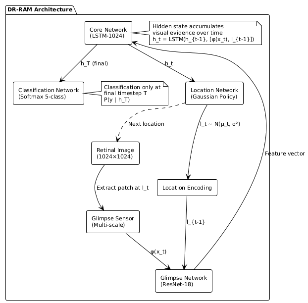
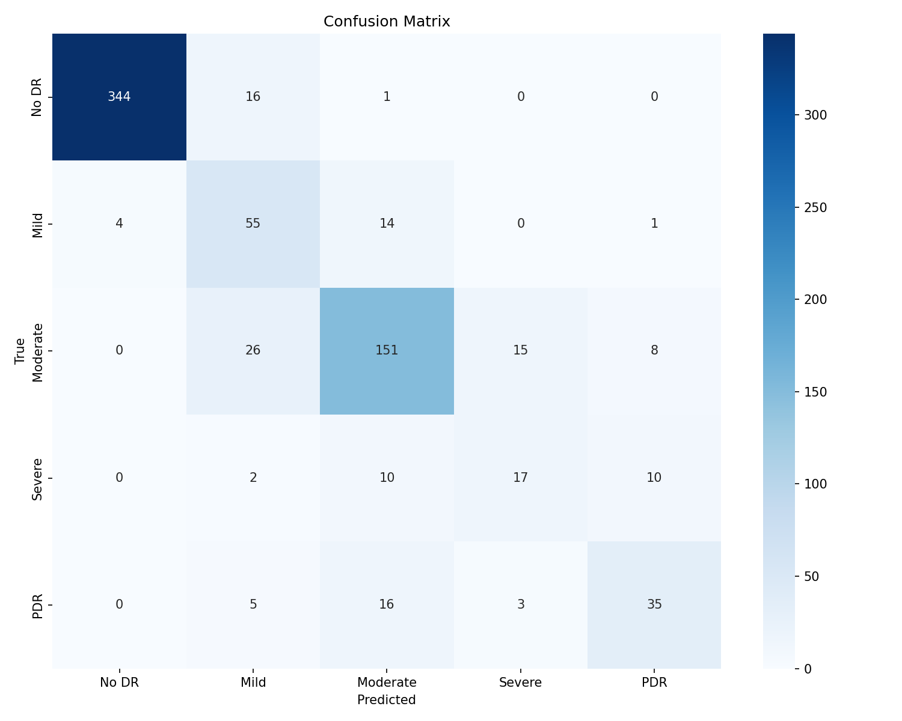

# 🔬 DR-RAM: Diabetic Retinopathy Recurrent Attention Model

[](https://www.kaggle.com/code/mahad69/dr-ram-diabetic-retinopathy-reinforcement-learning)
[](https://www.python.org/)
[](https://pytorch.org/)
[](LICENSE.md)

A novel deep learning approach for **Diabetic Retinopathy (DR) detection** using **Recurrent Attention Mechanisms** inspired by Reinforcement Learning. DR-RAM learns to sequentially attend to diagnostically relevant regions of retinal fundus images, mimicking the visual search behavior of expert ophthalmologists.

<p align="center">
  
</p>

---

## 📊 Results

Our model achieves **state-of-the-art performance** on the APTOS 2019 dataset, outperforming standard CNN baselines:

| Model | Accuracy | Precision | Recall | F1-Score | **Kappa** |
|-------|----------|-----------|--------|----------|-----------|
| **DR-RAM (Ours)** | **82.13%** | **83.28%** | **82.13%** | **82.48%** | **0.8914** |
| EfficientNet-B0 | 79.81% | 81.88% | 79.81% | 80.43% | 0.8702 |

> **Key Achievement:** DR-RAM improves Quadratic Weighted Kappa by **+2.12%** while providing interpretable attention trajectories.

### Confusion Matrix
<p align="center">
  
</p>

### Attention Trajectory Visualization
DR-RAM provides **interpretable diagnosis** by showing exactly where the model looked:

<p align="center">
  
</p>

---

## 🏗️ Architecture

DR-RAM consists of four interconnected neural network modules:

1. **Glimpse Sensor**: Extracts multi-scale patches (foveal + peripheral vision)
2. **Glimpse Network**: CNN-based feature extraction with location encoding
3. **Core Network**: GRU-based recurrent state aggregation
4. **Location & Classification Networks**: Attention policy and final prediction

```
Input Image → [Glimpse Sensor] → [Glimpse Network] → [GRU Core] → [Classifier]
                    ↑                                      ↓
                    └──────── [Location Network] ←─────────┘
```

---

## 🚀 Quick Start

### 1. Clone the Repository

```bash
git clone https://github.com/Ahad690/DR-RAM-Diabetic-Retinopathy-Detection.git
cd DR-RAM-Diabetic-Retinopathy-Detection
```

### 2. Create Virtual Environment

```bash
# Using conda (recommended)
conda create -n drram python=3.10
conda activate drram

# Or using venv
python -m venv drram_env
source drram_env/bin/activate  # Linux/Mac
# drram_env\Scripts\activate   # Windows
```

### 3. Install Dependencies

```bash
pip install -r requirements.txt
```

### 4. Download Dataset

Download the [APTOS 2019 Blindness Detection](https://www.kaggle.com/competitions/aptos2019-blindness-detection/data) dataset from Kaggle and extract it:

```bash
# Using Kaggle CLI
kaggle competitions download -c aptos2019-blindness-detection
unzip aptos2019-blindness-detection.zip -d data/
```

### 5. Run Training

```bash
# Run the Jupyter notebook
jupyter notebook notebooks/dr-ram-aptos2019.ipynb

# Or run on Kaggle (recommended for GPU)
# Upload notebook to Kaggle and enable GPU accelerator
```

### 6. Run Inference

To test the model on a sample image and visualize the attention trajectory, use the provided inference script. The project includes a `sample_images/` folder with 20 test images from the APTOS dataset.

#### Quick Start (Colab/Kaggle)
Copy and paste this single cell into your notebook to run inference immediately:

```python
# 1. Clone & Setup
import os
REPO_NAME = 'DR-RAM-Diabetic-Retinopathy-Detection'
if not os.path.exists(REPO_NAME):
    !git clone https://github.com/Ahad690/{REPO_NAME}.git
    
%cd {REPO_NAME}
!pip install -r requirements.txt -q

# 2. Run Inference (picks a random image from sample_images/)
!python notebooks/inference.py

# 3. Display Result
from IPython.display import Image, display
display(Image('prediction_result.png'))
```

> [!TIP]
> By default, the script picks the first image from `sample_images/`. You can change the `IMAGE_PATH` variable in `notebooks/inference.py` to test any of the 20 images.

---

## 📁 Project Structure

```
DR-RAM-Diabetic-Retinopathy-Detection/
│
├── 📓 notebooks/
│   ├── dr-ram-aptos2019.ipynb      # Main training notebook
│   └── inference.py                # Model inference & visualization
│
├── 📊 results/
│   ├── checkpoints/                # Model weights
│   │   ├── drram_best.pth          # Best DR-RAM model
│   │   └── baseline_best.pth       # Best baseline model
│   └── results/                    # Visualization & metrics
│       ├── confusion_matrix.png    # Confusion matrix
│       ├── comparison.png          # Model comparison
│       ├── attention_0.png         # Trajectory sample 1
│       ├── attention_1.png         # Trajectory sample 2
│       ├── attention_2.png         # Trajectory sample 3
│       ├── attention_3.png         # Trajectory sample 4
│       └── results.json            # Detailed metrics
│
├── 📄 LaTeX_project/               # LaTeX source for report
│   ├── main.tex                    # Main LaTeX file
│   └── architecture.png            # Architecture diagram
│
├── 🎨 sample_images/               # Sample retinal images for testing
│
├── 📜 Report.pdf                   # Final research report
├── 📋 requirements.txt             # Python dependencies
├── 📖 README.md                    # This file
└── 📜 LICENSE.md                   # MIT License
```

---

## ⚙️ Training Configuration

| Hyperparameter | Value |
|----------------|-------|
| Image Size | 380 × 380 |
| Glimpse Size | 64 × 64 |
| Number of Glimpses | 6 |
| Number of Scales | 3 |
| Hidden Size | 512 |
| Batch Size | 32 |
| Epochs | 15 |
| Learning Rate | 3 × 10⁻⁴ |
| Optimizer | AdamW |
| Weight Decay | 10⁻⁴ |
| Label Smoothing | 0.1 |
| Backbone | EfficientNet-B0 (pretrained) |

---

## 📈 Dataset

We use the **APTOS 2019 Blindness Detection** dataset from Kaggle:

| Class | Description | Count | Percentage |
|-------|-------------|-------|------------|
| 0 | No DR | 1,805 | 49.3% |
| 1 | Mild NPDR | 370 | 10.1% |
| 2 | Moderate NPDR | 999 | 27.3% |
| 3 | Severe NPDR | 193 | 5.3% |
| 4 | Proliferative DR | 295 | 8.1% |
| **Total** | | **3,662** | **100%** |

**Preprocessing Pipeline:**
1. Black border cropping (grayscale thresholding)
2. Ben Graham's preprocessing for illumination normalization
3. Resize to 380 × 380 pixels

---

## 🔗 Links

- **Kaggle Notebook:** [DR-RAM Training Notebook](https://www.kaggle.com/code/mahad69/dr-ram-diabetic-retinopathy-reinforcement-learning)
- **Dataset:** [APTOS 2019 Blindness Detection](https://www.kaggle.com/competitions/aptos2019-blindness-detection)
- **Original RAM Paper:** [Recurrent Models of Visual Attention (NeurIPS 2014)](https://arxiv.org/abs/1406.6247)

---

## 📚 Citation

If you use this code in your research, please cite:

```bibtex
@misc{drram2025,
  author = {Imran, Ahad and Abidin, Zain-Ul and Karim, Hamza Abdul and Aftab, Imaan},
  title = {DR-RAM: Diabetic Retinopathy Detection Using Recurrent Attention and Reinforcement Learning},
  year = {2025},
  publisher = {GitHub},
  howpublished = {\url{https://github.com/Ahad690/DR-RAM-Diabetic-Retinopathy-Detection}}
}
```

---

## 📝 Key References

1. V. Mnih et al., "[Recurrent Models of Visual Attention](https://arxiv.org/abs/1406.6247)," NeurIPS, 2014.
2. M. Tan and Q. V. Le, "[EfficientNet: Rethinking Model Scaling](https://arxiv.org/abs/1905.11946)," ICML, 2019.
3. L. Dai et al., "[A deep learning system for detecting diabetic retinopathy](https://www.nature.com/articles/s41467-021-23458-5)," Nature Communications, 2021.
4. V. Gulshan et al., "[Development and Validation of a Deep Learning Algorithm for Detection of Diabetic Retinopathy](https://jamanetwork.com/journals/jama/fullarticle/2588763)," JAMA, 2016.

---

## 👥 Authors

| Name | Roll Number | GitHub |
|------|-------------|--------|
| Ahad Imran | F23607034 | [@ahadimran](https://github.com/ahad690) |
| Zain-Ul-Abidin | F23607031 | |
| Hamza Abdul Karim | F23607046 | |
| Imaan Aftab | F23607041 | |

**Course:** CS480 - Reinforcement Learning  
**Instructor:** Lec. Asif Mehmood  
**Institution:** NUTECH

---

## 📄 License

This project is licensed under the MIT License - see the [LICENSE.md](LICENSE.md) file for details.

```
MIT License

Copyright (c) 2025 Ahad Imran, Zain-Ul-Abidin, Hamza Abdul Karim, Imaan Aftab

Permission is hereby granted, free of charge, to any person obtaining a copy
of this software and associated documentation files (the "Software"), to deal
in the Software without restriction, including without limitation the rights
to use, copy, modify, merge, publish, distribute, sublicense, and/or sell
copies of the Software, and to permit persons to whom the Software is
furnished to do so, subject to the following conditions:

The above copyright notice and this permission notice shall be included in all
copies or substantial portions of the Software.

THE SOFTWARE IS PROVIDED "AS IS", WITHOUT WARRANTY OF ANY KIND, EXPRESS OR
IMPLIED, INCLUDING BUT NOT LIMITED TO THE WARRANTIES OF MERCHANTABILITY,
FITNESS FOR A PARTICULAR PURPOSE AND NONINFRINGEMENT. IN NO EVENT SHALL THE
AUTHORS OR COPYRIGHT HOLDERS BE LIABLE FOR ANY CLAIM, DAMAGES OR OTHER
LIABILITY, WHETHER IN AN ACTION OF CONTRACT, TORT OR OTHERWISE, ARISING FROM,
OUT OF OR IN CONNECTION WITH THE SOFTWARE OR THE USE OR OTHER DEALINGS IN THE
SOFTWARE.
```

---

## 🙏 Acknowledgments

- [Kaggle](https://www.kaggle.com/) for providing free GPU resources
- [APTOS](https://www.kaggle.com/competitions/aptos2019-blindness-detection) for the dataset
- [PyTorch](https://pytorch.org/) team for the deep learning framework
- Course instructor Lec. Asif Mehmood for guidance

---

<p align="center">
  <b>⭐ If you find this project useful, please consider giving it a star! ⭐</b>
</p>